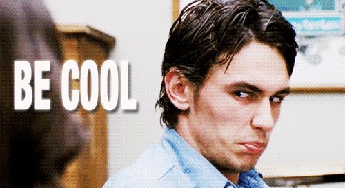

# Contributing to the bootcamp
Well hello there sir! :bowtie:  
(or Ma'am? :princess:)

Doesn't matter, all are welcomed here!  
Yup, even this guy --> :alien:

I :heart: you taking the :hourglass: to contribute to this bootcamp. I know how busy you are, so I'll keep this short:

The templates for [PRs](https://github.com/goldylucks/react-beginners-bootcamp/pull) and [issues](https://github.com/goldylucks/react-beginners-bootcamp/issues) are there for a reason. Please read 'em!

Here are two more emoticons just to make sure you do read them: :eyeglasses: :eyes:

Other than that, let's all adhere to the [code of conduct](CODE_OF_CONDUCT.md), or in other words, let's just be cool, aight? ;)

Thanks again for contributing, YOU :rocket::rocket::rocket: !!!

  

